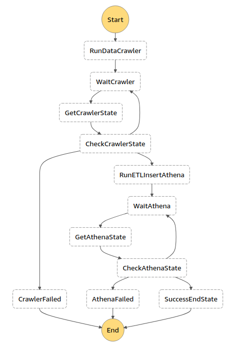

# Serverless data pipelines: ETL workfow with Step Functions and Athena

This blog is Part 3 of a multi-part series around analysing Flanders’ traffic whilst leveraging the power of cloud components!  
For part 1 see: [https://medium.com/cloudway/real-time-data-processing-with-kinesis-data-analytics-ad52ad338c6d](https://medium.com/cloudway/real-time-data-processing-with-kinesis-data-analytics-ad52ad338c6d)  
For part 2 see: [https://medium.com/cloubis/serverless-data-transform-with-kinesis-e468abd33409](https://medium.com/cloubis/serverless-data-transform-with-kinesis-e468abd33409)

# What is our goal?

The goal of this blog to explore the use of the AWS Glue service in conjunction with the AWS Athena service in order to repartition raw streaming data events. We previously landed these events on an Amazon S3 bucket partitioned according to the processing time on Kinesis. Now, however, we would like to have these events partitioned according to event timestamps to allow for meaningful batch analysis.

# First, a short introduction to AWS Glue

AWS Glue (which was introduced in august 2017) is a serverless Extract, Transform and Load (ETL) cloud-optimized service. This service can used be used to automate ETL processes that organize, locate, move and transform data sets stored within a variety of data sources, allowing users to efficiently prepare these datasets for data analysis. These data sources can e.g., be data lakes in Amazon Simple Storage Service (S3), data warehouses in Amazon Redshift or other databases that are part of the Amazon Relational Database Service. Other types of databases such as MySQL, Oracle, Microsoft SQL Server and PostgreSQL are also supported in AWS GLue.

Since AWS Glue is a serverless service, users are not required to provision, configure and spin-up servers and they do not need to spend time managing servers.

At the heart of AWS Glue is the Catalog, a centralized metadata repository for all data assets. In this repository, all relevant information about data assets (such as table definitions, data locations, file types, schema information) is stored.

In order to get this information into the Catalog AWS GLue uses crawlers. These crawlers can scan data stores and automatically infer the schema of any structured and semi-structured data that might be contained within the data stores.  
These crawlers can:

- automatically discover datasets
- discover file types
- extract the schema
- store all this information in the Catalog.

When data has been cataloged, it can then be accessed and ETL jobs can be performed on it. AWS Glue provides the capability to automatically generate ETL scripts, which can be used as a starting point, meaning users do not have start from scratch when developing ETL processes. In this blog however, we will be focussing on the use of an alternative to the AWS Glue ETL jobs. We will be making use of SQL queries implemented in AWS Athena to perform the ETL process.

For the implementation and orchestration of more complex ETL processes, AWS Glue provides users with option of using workflows. These can be used to coordinate more complex ETL activities involving multiple crawlers, jobs and triggers. We will however be using an alternative to the these AWS Glue workflows, namely a state machine with step functions to coordinate our ETL process.

To reiterate, AWS Glue has 3 main components:

- The Data Catalog, a centralized metadata repository, where all metadata information concerning your data is stored. This includes information about tables (which define the metadata representations or schemas of the stored datasets), schemas and partitions. The metadata properties are inferred within data sources by crawlers, which also provide connections with them.
- The Apache Spark ETL engine. Once metadata is available in the data catalog and source and target data stores can be selected form the catalog, the Apache Spark ETL engine allows for the creation of ETL jobs that can be used to process the data.
- The Scheduler. Users can set-up a schedule for their AWS ETL jobs. This schedule can be linked to a specific trigger (e.g. the completion of another ETL job), a particular time of day or a job can be set-up to run on-demand.

# State machine

As mentioned above, our goals is the creation of an ELT pipeline which will repartition the data we already landed in an S3 datalake.
This repartitioning will make sure the data is partitioned based on a timestamp within the event.
This fits our analysis purposes as apposed to partitioning based on the timestamp at which the record arrived on kinesis firehose.

In order to achieve this we build an ETL job to extract the existing data from S3, transform it by creating new columns based on the event timestamp from within the data and land it in new partitions.

Specifically the ETL jobs achieved the following:

- First we needed to figure out what the current data looked like.
  In other words, we needed to register a schema for our source data (i.e. the data partitioned according to Kinesis Firehose timestamps, which we landed on S3) in the Glue Catalog.
- In order to determine this schema we needed to run a crawler, which explored the existing data and determined the format of this data.
  Running the crawler created a schema for the source data an registered that schema with the Glue catalog.
- Next we needed to run an ETL process in order to transform the data into new partitions.
  As already mentioned, in this blog we will focus on the use of Athena to achieve the repartitioning.
  Read our next blog to see how it is done with AWS Glue.
- After the data was repartitioned, we of course wanted to be able to query the data for analysis purposes.
  To achieve this, we needed to run a crawler again to establish what the repartitioned data looked like.
  The crawler then registered the new schema in the Glue Catalog.

To run this process continuously would not be very efficient.
On the other hand, running this process not frequently enough (only once a week for example) would mean that we would have to wait too long to be able report on new data.

We have a process of a few managed steps (running crawler, registering schema, executing ETL job, running crawler) that we need to orchestrate on a regular basis.
Hence, it would be ideal for orchestration using AWS step functions.

_In AWS Step Functions you define your workflows in the Amazon States Language.
The Step Functions console provides a graphical representation of that state machine to help visualize your application logic.
States are elements in your state machine.
A state is referred to by its name, which can be any string, but which must be unique within the scope of the entire state machine_

Here is overview of what our state machine looked like:



As you see we have a finite number of steps each being executed one after the other.

### ASL - Amazon State Language

A state machine is defined using the `ASL` or Amazon States Language.
This is a JSON base language to define the steps of your state machine.
Later we will look deeper into the logic executed in each step.
Let's first look at the ASL that defines these steps.

AWS Sam and the Serverless Framework both allow you to specify the ASL as `yaml`.
We found that using `yaml` improved readability.
As such we defined our `ASL` as follows (complete `ASL` schema available [here](https://github.com/becloudway/serverless-data-pipelines-batch-processing)):

```yaml
BatchProcessingStateMachine:
  events:
    - schedule: rate(1 day)
  name: BatchProcessingStateMachine
  definition:
    Comment: "State machine for the batch processing pipeline"
    StartAt: RunDataCrawler
    States:
      RunDataCrawler:
        Type: Task
        Resource: arn:aws:lambda:#{AWS::Region}:#{AWS::AccountId}:function:${self:service}-${opt:stage}-RunDataCrawler
        Next: WaitCrawler
      WaitCrawler:
        Type: Wait
        Seconds: 30
        Next: GetCrawlerState
      GetCrawlerState:
        Type: Task
        Resource: arn:aws:lambda:#{AWS::Region}:#{AWS::AccountId}:function:${self:service}-${opt:stage}-GetCrawlerState
        Next: CheckCrawlerState
      CheckCrawlerState:
        Type: Choice
        Default: WaitCrawler
        Choices:
          - And:
            - Variable: '$.CrawlerState'
              StringEquals: READY
            - Variable: '$.CrawlerStatus'
              StringEquals: SUCCEEDED
            Next: RunETLInsertAthena
          - And:
            ...
```

This `ASL` describes the same workflow as the state image above.
It's only much harder to read for human eyes.

Note that we indeed have the steps: running crawler, registering schema, executing ETL job, running crawler.
But we also have "wait" steps were we periodically check if a crawler is ready with his work.
And we have failure states that we use to react on failure in our process.

Since this blog focusses on data and not on how to build state machines we'll put a link here if you want to know more about `AWS State Machines` and `Step Functions`: [click here](https://aws.amazon.com/getting-started/hands-on/create-a-serverless-workflow-step-functions-lambda/).

In the resources you'll find a link to a great course by [Yan Cui](https://theburningmonk.thinkific.com/courses/complete-guide-to-aws-step-functions).

### Logic of Step functions

Now it is time to look a little deeper into what happens during every step.

> Tip: Choose descriptive names for your steps so that it is clear immediately clear what happens in a certain step.

Here are a few of our steps (again, check out the repository if you want to see all the logic):

**RunDataCrawler**
This triggers the executing of a Lambda Function which in turn triggers a Glue Crawler

```python
glue_client = boto3.client('glue')
CRAWLER_NAME = os.environ['CRAWLER_NAME']


def handle(event, context):
    timezone = pytz.timezone('Europe/Brussels')
    now = datetime.now(timezone)
    response = glue_client.start_crawler(Name=CRAWLER_NAME)
    return {'response': response, 'year': event.get('year', now.year), 'month': event.get('month', now.month), 'day': event.get('day', now.day-1)}
```

**GetCrawlerState**
We are periodically checking the state of the running crawler.
Since there is no direct integration for crawler events with step functions (yet?), we have to check this using a lambda function.

```python
glue_client = boto3.client('glue')
CRAWLER_NAME = os.environ['CRAWLER_NAME']


def handle(event, context):
    response = glue_client.get_crawler(Name=CRAWLER_NAME)['Crawler']
    return {'CrawlerState': response['State'], 'CrawlerStatus': response.get('LastCrawl', {'Status': None})['Status'],
            'year': event['year'], 'month': event['month'], 'day': event['day']}
```

This returns the state of the crawler, thus telling us whether or not the crawler is finished.
As you can see from the diagram and the ASL, we'll use this status to make a `choice` for what is the next step to execute.

**RunETLInsertAthena**
When the crawler is finished it is time to run the ETL job.
This is done using AWS `Athena`.
Read more about the how and what of `Athena` in the next paragraph.

It is however the job of a Lambda function to start the ETL job in `Athena` and to check when it is finished.

The handler of the lambda function that starts the ETL job looks as follows.

```python
def handle(event, context):
    try:
        queries = create_queries(event['year'], event['month'], event['day'])
        ...
        try:
            response = execute_query(query)
            execution_ids.append(response)
        except Exception as e:
            return {'Response': 'FAILED', 'Error': str(e)}
    return {'Response': 'SUCCEEDED', 'QueryExecutionIds': execution_ids}

```

- Define the queries, specifying which data range you want to repartition.
- Pass this queries to `Athena`.
- Return the Athena execution ID. An ID that we can use to check on the state of the ETL job with Athena.

The next function checks if the ETL job is finished.
It does so by using the execution ID that was returned from the latest step.

```python
def handle(event, context):
    response = athena_client.batch_get_query_execution(QueryExecutionIds=event['QueryExecutionIds'])
    for execution in response['QueryExecutions']:
        state = execution['Status']['State']
        if state != 'SUCCEEDED':
            return {'AthenaState': state, 'QueryExecutionId': execution['QueryExecutionId'], 'QueryExecutionIds': event['QueryExecutionIds']}
        ...
    return {'AthenaState': 'SUCCEEDED'}
```

The `QueryExecutionIds` from the previous step are now used to get the status of a specific query.

We saw the steps necessary in the workflow to repartition our data.
This repartitioning was achieved with Athena.
Let's dive deeper into that in the next paragraph.

# Athena Service

As stated above, we used AWS Athena to run the ETL job, instead of a Glue ETL job with an auto generated script.

The querying of datasets and data sources registered in the Glue Data Catalog is supported natively by AWS Athena. This means Athena will use the Glue Data Catalog as a centralized location where it stores and retrieves table metadata. This metadata instructs the Athena query engine where it should read data, in what manner it should read the data and provides additional information required to process the data.
It is, for example, possible to run an INSERT INTO DML query against a source table registered with the Data Catalog. This query will insert rows into the destination table based upon a SELECT statement run against the source table.  
Directly below we show part of our complete INSERT INTO DML query, which has additional nested subqueries in which data from the source table is transformed step by step so that it can be repartitioned and used for analysis.

```sql
INSERT INTO "traffic"."sls_data_pipelines_batch_transformed"
SELECT uniqueId, recordTimestamp, currentSpeed, bezettingsgraad, previousSpeed,
  CASE
    WHEN (avgSpeed3Minutes BETWEEN 0 AND 40) THEN 1
    WHEN (avgSpeed3Minutes BETWEEN 41 AND 250) THEN 0
    ELSE -1
  END
    as trafficJamIndicator,
  CASE
    WHEN (avgSpeed20Minutes BETWEEN 0 AND 40) THEN 1
    WHEN (avgSpeed20Minutes BETWEEN 41 AND 250) THEN 0
    ELSE -1
  END
    as trafficJamIndicatorLong, trafficIntensityClass2, trafficIntensityClass3, trafficIntensityClass4, trafficIntensityClass5, speedDiffindicator, avgSpeed3Minutes, avgSpeed20Minutes, year, month, day, hour
FROM
  (SELECT uniqueId, recordTimestamp, currentSpeed, bezettingsgraad, previousSpeed, trafficIntensityClass2, trafficIntensityClass3, trafficIntensityClass4, trafficIntensityClass5,
  CASE
    WHEN (currentSpeed - previousSpeed >= 20) THEN 1
    WHEN (currentSpeed - previousSpeed <= -20) THEN -1
    ELSE 0
  END
  AS speedDiffindicator, avg(currentSpeed)
  OVER (PARTITION BY uniqueId ORDER BY originalTimestamp ROWS BETWEEN 2 PRECEDING AND 0 FOLLOWING)
    AS avgSpeed3Minutes, avg(currentSpeed)
  OVER (PARTITION BY uniqueId ORDER BY originalTimestamp ROWS BETWEEN 19 PRECEDING AND 0 FOLLOWING)
    AS avgSpeed20Minutes,year(originalTimestamp) as year, month(originalTimestamp) as month, day(originalTimestamp) as day, hour(originalTimestamp) as hour
FROM
(SELECT...

```

The (part of the) INSERT INTO DML query shown directly above, performed the following:

- Final selection of relevant information for data analysis.
  Not all information contained in the raw data was useful for analysis and some data was possibly invalid (e.g. due to malfunctioning measuring equipment)
- The computation of aggregate values and derived fields to be used for analysis purposes.
  For example calculation of the average speed and the implementation of the logic of what we consider a traffic jam.
- The repartitioning of the data by event time (i.e the year, month and day values of the originalTimestamp).
  Repartitioning is achieved by first defining a target table in the AWS Glue Catalog in which year, month, day and hour bigint fields were designated as Partition keys.
  Subsequently, we extracted the year, month and day values of the originalTimestamp (i.e. the timestamp of the measurement itself, not the timestamp of the processing time on Kinesis) and finally these values where assigned to the year, month, day and hour bigint fields which we designated as Partition keys in the target table.

The additional nested subqueries, performed the following:

- The selection and transformation (where necessary) of relevant information from the source data for the computation of aggregate values and derived fields.
- The selection of a subset of locations from the total amount of 4600 measurement locations and the natural regrouping of these locations (e.g. grouping of sets of lanes on the same road).
- The splitting of queries into data ranges of (maximum) 4 days (i.e. a range between a start day and an end day).
  Because Amazon imposes a limit of 100 simultaneously written partitions using an INSERT INTO statement, we implemented a Lambda function to execute multiple concurrent queries. The splitting of the queries, limits the amount of simultaneously written partitions to 96 hours.

For a link to the complete INSERT INTO DML query, please refer to [https://github.com/becloudway/serverless-data-pipelines-batch-processing/blob/master/queries/InsertETL.sql](https://github.com/becloudway/serverless-data-pipelines-batch-processing/blob/master/queries/InsertETL.sql).  
For a link to the explanation of field definitions please refer to [this link](https://github.com/becloudway/serverless-data-pipelines-batch-processing).

When using AWS Athena to perform the ETL job, as opposed to using Glue ETL jobs, there is no functionality to automatically start the next process in a workflow.
Therefore we also implemented a polling mechanism in order to periodically check for crawler/ETl query completion.

# Alternative solution for the ETL workflow

As already mentioned several times, we could also have used Glue ETL jobs for the implementation of the ETL workflow. These ETL jobs handle all processing and repartitioning of the data through python scripts with Spark.

In our next blog in the series we will explore the practical implementation of this alternative solution and compare the advantages and disadvantages of the use of Glue ETL jobs vs. AWS Athena ETL queries for the implementation of ETL workflows.

# Resources

- Step Function course: [https://theburningmonk.thinkific.com/courses/complete-guide-to-aws-step-functions](https://theburningmonk.thinkific.com/courses/complete-guide-to-aws-step-functions)
- Serverless workflow with Step Functions: [https://aws.amazon.com/getting-started/hands-on/create-a-serverless-workflow-step-functions-lambda/](https://aws.amazon.com/getting-started/hands-on/create-a-serverless-workflow-step-functions-lambda/)
- Data - field definitions: [https://github.com/becloudway/serverless-data-pipelines-batch-processing](https://github.com/becloudway/serverless-data-pipelines-batch-processing)
