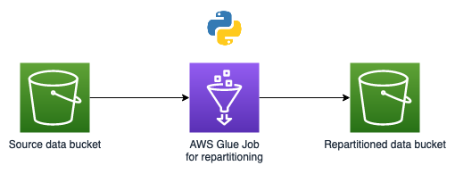

# ETL with AWS Glue Jobs

# Technical solution

> Our mission: use AWS Glue jobs to repartition data on S3 based on a date field in the data records.

When we land data on an Amazon S3 bucket using a Kinesis Firehose then the data partitioned according to the processing time on Kinesis.  
Now we are going to use a timestamp in the data to repartition the data on S3.

We choose to define our job using Python.

The architecture of this solution is pretty straight forward:



## Defining the job

Let's now focus on the definition of the job itself.

Defining a Glue Job's pipeline script using pipeline had big advantages in terms of readability:

- The code written in `python` is a lot more readable compared to defining this repartition logic as pure `SQL`.
- Within the job we have a clear step by step process.
- Working with dataFrame's and libraries like `Pandas` will feel familiar for most data engineers.

## Running the job

You can find the complete job here: // TODO: add link
We will now break the job down in smaller components:

**Create a frame that holds the existing data**
Our data was sitting on S3.
The format of this data has been registered in AWS Glue as a Glue schema in the Data Catalogue.
This meant that we could load the data from S3 by telling Glue which schema to use.  
We then built a data frame to make manipulating the data easy.

```
datasource0 = glueContext.create_dynamic_frame_from_catalog(
    database='anpr',
    table_name="anpr_parquet_step1_with_crawlerresults",
    push_down_predicate = f"year = 2020 and month = {d_time.month} and day = {d_time.day} and hour = {d_time.hour}",
    transformation_ctx = "datasource0")
df = datasource0.toDF()
```

**Create new columns to use for repartitioning**  
Now we can use this dataframe and extend it with new columns that contain the year, month, day and hour info of when the record was originally produced.

```
df.select(
    year("originalrecordtimestamp").alias('year'),
    month("originalrecordtimestamp").alias('month'),
    dayofmonth("originalrecordtimestamp").alias('day'),
    hour("originalrecordtimestamp").alias('hour')
).show()
```

**Use the new columns in a new dataframe**

```
dyf = DynamicFrame.fromDF(repartitioned_with_new_columns_df, glueContext, "enriched")
```

**Use the new dataframe to land (sink) our data to S3**  
We will now use the new columns to partition the data in our data lake.  
Don't forget to commit the result of the job.

```
s3_path = "s3://sls-data-pipelines-test-05-22/analytics/repartitioned_results/"
options_connect = {"path": s3_path,"partitionKeys":["year","month","day","hour"]}

datasink = glueContext.write_dynamic_frame.from_options(frame = dyf, connection_type="S3", connection_options = options_connect , format = "parquet", transformation_ctx = "datasink5")

job.commit()
```
