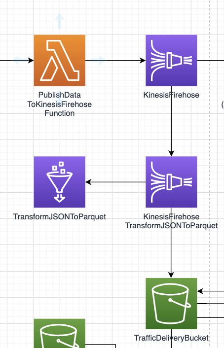

# Serverless data transform with kinesis

## What are we trying to do here (David)

The goal of this blog is to explore the use of Amazon Kinesis Data Firehose service to load raw streaming data events on an Amazon S3 bucket (thus creating a data lake) in a format that lends itself to efficient batch processing of those events, to allow for the analysis and visualization of the streaming data over longer time frames.

The source data used for this purpose is traffic data, pulled from an API of the governement of Flanders (verwijzing naar vorige blog?) -- uitleg batch vs real time invoegen --, which will be transformed into an easily queryable format using an ETL workflow.

To implement such an ETL workflow using AWS services, multiple approaches are  possible. It is, for example, possible to implement the ETL flow using the AWS Data Pipeline service in concert with the the Amazon EMR service. However, this approach - which could be labeled as a 'traditional' approach - is not easy to implement and furthermore is not serverless, thus requiring management of the underlying infrastructure. The introduction, in recent years, of serverless AWS services (e.g. AWS Glue, AWS step functions, AWS Lambda,...) however, has made it possible to achieve a completely serverless ETL workflow with reduced complexity from an implementational an management viewpoint.

In the following we will explore and compare the different serverless AWS services options that are currently available and also discuss the considerations that should be taken into account with regard to the choice of data format to be used in the data lake (e.g. access pattern and partitioning of the data).  

<!-- - land raw events on s3
- create a data lake on s3 to query on
- create a data lake in a queryable format
- think about access pattern and partitioning -->

## Landing data on s3 with Kinesis Firehose

### Kinesis data streams vs Kinesis firehose (Nick)

- mooi vergelijkende afbeelding

## Transform and land the data

### converting / transforming the data format (David)

From json to parquet

There are to main considerations which led to the choice of using the parquet file format for the storage of the data on S3

The first consideration is query efficiency. 
- Why?
  - Better queryable
  - Less storage needed

### Partitioning using firehose (Nick)

What is and isn't possible

-> Hive style partitioning and the advantages
`myPrefix/year=!{timestamp:yyyy}/month=!{timestamp:MM}/day=!{timestamp:dd}/hour=!{timestamp:HH}/`

[https://docs.aws.amazon.com/athena/latest/ug/partition-projection-kinesis-firehose-example.html](https://docs.aws.amazon.com/athena/latest/ug/partition-projection-kinesis-firehose-example.html)
[https://aws.amazon.com/blogs/big-data/amazon-kinesis-data-firehose-custom-prefixes-for-amazon-s3-objects/](https://aws.amazon.com/blogs/big-data/amazon-kinesis-data-firehose-custom-prefixes-for-amazon-s3-objects/)

# Cloudformation example?

# Conclusion (Nick + David)

We have created a datalake on s3 that is partitioned, queryable and in optimal format.
