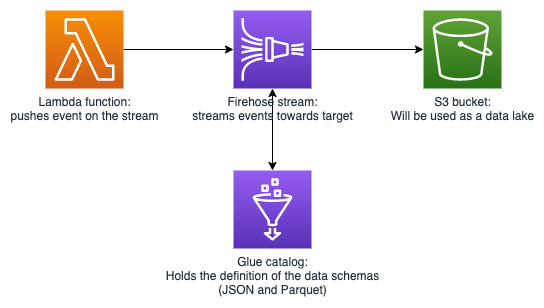

# Serverless data transform with kinesis



## What are we trying to do here (David)

The goal of this blog is to explore the use of Amazon Kinesis Data Firehose service to load raw streaming data events on an Amazon S3 bucket (thus creating a data lake) in a format that lends itself to efficient batch processing of those events, to allow for the analysis and visualization of the streaming data over longer time frames.

The source data used for this purpose is traffic data, pulled from an API of the governement of Flanders.  
We also used this data in our blog around realtime data processing: (https://medium.com/cloudway/real-time-data-processing-with-kinesis-data-analytics-ad52ad338c6d)[https://medium.com/cloudway/real-time-data-processing-with-kinesis-data-analytics-ad52ad338c6d].  
In this blog and the next we will use this data for processing via an ETL workflow.

To implement such an ETL workflow using AWS services, multiple approaches are  possible. 
It is, for example, possible to implement the ETL flow using the AWS Data Pipeline service in concert with the the Amazon EMR service. 
However, this approach - which could be labeled as a 'traditional' approach - is not easy to implement and furthermore is not serverless, thus requiring management of the underlying infrastructure. 
The introduction, in recent years, of serverless AWS services (e.g. AWS Glue, AWS step functions, AWS Lambda,...) however, has made it possible to achieve a completely serverless ETL workflow with reduced complexity from an implementational an management viewpoint.

In the following we will explore and compare the different serverless AWS services options that are currently available and also discuss the considerations that should be taken into account with regard to the choice of data format to be used in the data lake (e.g. access pattern and partitioning of the data).  

## Landing data on s3 with Kinesis Firehose
As already mentioned, our goal is to land our data on an S3 bucket. 
Luckily, Amazon provides two managed solutions which will allow us to achieve this. 
These services, called AWS Kinesis Firehose and AWS Kinesis Data Streams, can be used to load data into AWS data stores. 

Next we will discuss the differences between these solutions and explain the choice to use Kinesis Firehose. 

### Kinesis data streams vs Kinesis firehose
AWS Kinesis Firehose and AWS Kinesis Data Streams offer a similar, yet different straming solution to transport and transform your data.

Let's explore the differences between these services. 

#### Kinesis Data Streams Properties
- Millisecond latency: used for realtime analytics and actions.
- Order is preserved per shard.
- Not completely serverless: you have to manage the amount of shards yourself.
- Secure durable storage of events on the stream up to 7 days.
- Can be digested with a Lambda function.

> Data Streams are for milliseconds realtime analytics.
> You have to manage the shards yourself which you can automate by using the Streams API. 

The latter means that when using a Kinesis data stream we ourselves our responsible for provisioning enough capacity on our stream via the provisioning of shards.
You can find more info [here](https://aws.amazon.com/kinesis/data-streams/faqs/#:~:text=Shard%20is%20the%20base%20throughput,you%20create%20a%20data%20stream.).

#### Kinesis Firehose Properties
- Completely serverless solution.
- Buffer size of 1 to 128 MiBs and a buffer interval of 60 to 900 seconds.
- Direct-to-data-store integration with S3, RedShift, ElasticSearch..
- Can convert record format before landing them in the datastore.

> Data Firehose is completely serverless and can be used for near realtime application. 

Since the current use case is to ingest the data, then convert it to the "parquet" format and finally to land it on an S3 bucket for further batch processing, Kinesis Firehose is the service whose properties are best suited.

## Transform and land the data

### converting / transforming the data format (David)
There are two main considerations which led to the choice of using the parquet file format, a columnar data storage format, for storing the data on S3.

Firstly, the parquet format provides efficient data compression, leading to a reduction of the storage that is required.
The amount of storage that is saved, will especially become more noticeable as the amount of data to be stored increases.  

Secondly, this format is optimized for query performance, which means that amount of data being scanned during querying will be siginificantly less (as compared to querying data in, e.g., the JSON format). 
This will result in reduced costs when the data is queried for further batch processing.

### Partitioning using firehose
As mentioned directly above using Kinesis Firehose allows us to transform the format of the records to parquet before landing the data on S3.

Next, let's look at the manner in which the data is organised on S3. 

The Kinesis Data Firehose service uses a UTC time prefix (in the form of 'YYYY/MM/DD/HH') by default to organize data when landing it on S3. 
It uses keys (separated by '/' in the prefix) to determine the path by which an object can be found in an S3 bucket.
Note that, even though these keys give the appearance of a folder structure, the AWS S3 structure does not work with folders. 

This way of organizing the data has several consequences:
 * All data is partitioned by Year, Month, Day and Hour (in that order) and Kinesis Data Firehose uses UTC time to generate the values of the partitions.
 * The UTC time values are determined by the time at which the data is processed by Kinesis Data Firehose.
 * Is is not possible to directly use event timestamps to land data in a particular partition.
 
 To summarize, Kinesis Data Firehose uses processing time stamps to create partitions on S3 and it is not possible to utilize timestamps which derive directly from your data.
 In our next blog, we will explore how to repartition data on S3 in order to organize events according to timestamps which are contained within the data of the event itself.


#### Hive

As we just mentioned data will land on S3 in partitions named via the timestamp at which the data was processed by Kinesis.
We will see in the next blog that we will refer to data in a certain partition by the name of that partition.  
The `Hive` naming convention allows us to give our partitions a name.

> Following the Hive naming convention for our partitions will allow us to give the partitions a functional name.

Here you see an example of an S3 key that follows his naming convention:

```
myOwnCustomS3Prefix/year=!{timestamp:yyyy}/month=!{timestamp:MM}/day=!{timestamp:dd}/hour=!{timestamp:HH}/
```

Firehose allows us to use the `Hive` naming convention.

As we can also see in the example above following the `Hive` specs the folder structure is of the format `/partitionkey1=partitionvalue1/partitionkey2=partitionvalue2`

In the AWS console you can specify an S3 prefix for your firehose.

<!-- TODO: add image of configuring this in the console -->


# Cloudformation example?
<!-- Todo -->
# Conclusion (Nick + David)

We have created a datalake on s3 that is partitioned, queryable and in optimal format.

